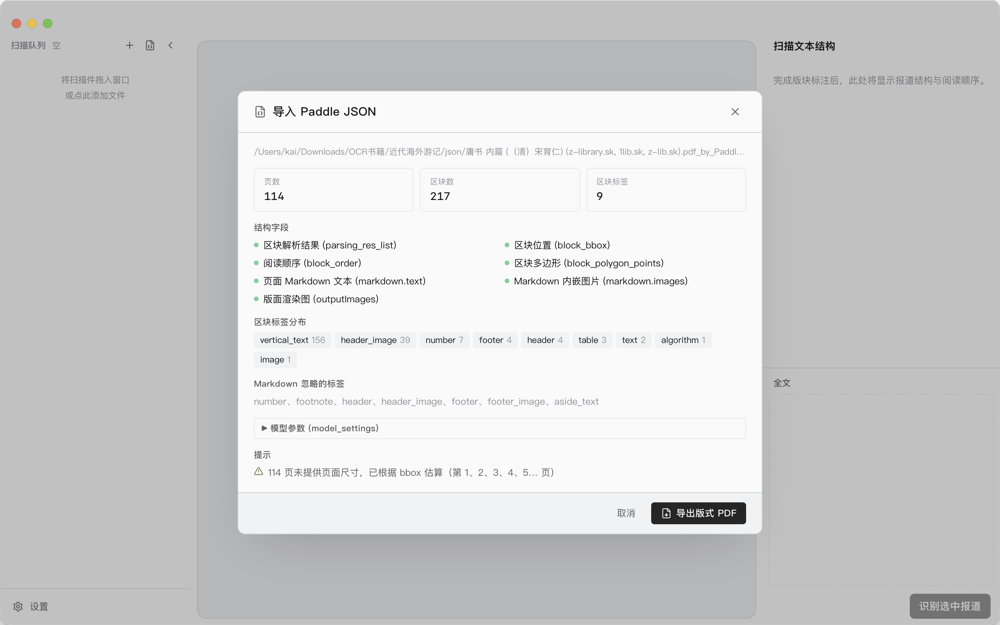

# Xcvt — 报刊版面 OCR

桌面 OCR 工具，专门处理近代中文报刊扫描件。导入图像或 PDF，框选报道版块或整页识别，多家
provider 任选，结果导出为 Markdown / 纯文本。

跨平台桌面应用，覆盖 macOS（Apple Silicon）与 Windows。**由于无Windows设备测试，Windows平台属于理论可用。**
也提供 Docker/Web 版，适合自托管使用。

## 特性

- **两种识别模式**：框选报道（一篇报道可跨多块、跨多页拼成完整文本）/ 全文按页识别。
- **多 provider 路由**：PaddleOCR（百度异步 jobs API）、OpenAI Vision、OpenRouter、任意
  OpenAI-compatible 自建端点。
- **结构化导出**：识别后的报道按选择顺序组装成单篇 Markdown，支持复制 / 单篇导出 / 整文档导出。
- **页码控制**：PDF 支持直接输入页码跳转；全文识别可指定 `1-5,8,10-12` 这类非连续页码范围。
- **Paddle 文档级 OCR**：一次性对整份 PDF 调用 Paddle 批量接口；大文件自动分块分批提交，
  语言、并发、每批页数均可配置。
- **Paddle JSON 复用（桌面版）**：可导入 Paddle 网页版 JSON，预检区块结构完整性，写入按页文本，重建为可复制文字的版式 PDF。
- **本地凭据**：桌面版 API key / Token 通过系统 Keychain（macOS）/ Credential Manager（Windows）
  保管；Docker 版写入挂载卷里的 `/data/secrets.json`，不会通过接口回传明文。

### 界面预览

**全文识别**


**框选识别**


**Paddle JSON 导入**



## 安装

正式包从 [Releases](https://github.com/WHkDd/xcvt-tauri/releases/latest) 下载：

- macOS Apple Silicon：`Xcvt_*_aarch64.dmg`
- Windows：`Xcvt_*_x64-setup.exe` 或 `Xcvt_*_x64_en-US.msi`（Windows版本理论可用，未测试）

### macOS 首次启动

当前首次双击会触发 Gatekeeper 拦截。

**终端命令**：把 dmg 里的 `Xcvt.app` 拖到 `/Applications`，然后运行

   ```bash
   xattr -dr com.apple.quarantine /Applications/Xcvt.app
   ```

### Windows 首次启动

SmartScreen 会显示蓝色拦截框。点 **更多信息 → 仍要运行** 即可。

## Docker 自托管

### docker compose

```bash
cp .env.example .env
docker compose up -d
```

然后打开 `http://localhost:8787`。第一次进入 Settings 填入自己的 Paddle/OpenAI/OpenRouter key。

升级：

```bash
docker compose pull
docker compose up -d
```

### docker run

```bash
docker run -d \
  --name xcvt \
  --restart unless-stopped \
  -p 8787:8787 \
  -v xcvt-data:/data \
  ghcr.io/whkdd/xcvt:latest
```

## 桌面版与 Docker/Web 版功能对比

| 能力 | 桌面版 | Docker/Web 版 |
|---|---:|---:|
| 文件导入、PDF 预览、页码跳转 | ✅ | ✅ |
| 框选报道 OCR | ✅ | ✅ |
| 全文按页 OCR | ✅ | ✅ |
| PaddleOCR / OpenAI / OpenRouter / OpenAI-compatible | ✅ | ✅ |
| Paddle 网页版 JSON 导入 | ✅ | — |
| 导出可复制文字的版式 PDF | ✅ | — |


## 待做

- 更多服务商接入（GLM-OCR等）
- Codex/Claude Code订阅支持
- 本地模型支持

## 技术栈

- **框架**：Tauri 2.x
- **前端**：React 18 · Vite · TypeScript · Zustand · Konva · Tailwind · shadcn/ui
- **后端**：Rust · `pdfium-render` · `reqwest` · `tokio` · `keyring` · Axum
- **OCR**：PaddleOCR（异步 jobs）· OpenAI Vision · OpenRouter · OpenAI-compatible
- **部署**：Tauri 桌面包 · Docker multi-arch (`linux/amd64`, `linux/arm64`)

## License

MIT — 见 [LICENSE](./LICENSE)。
