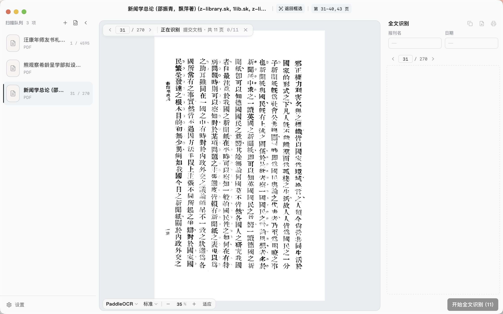
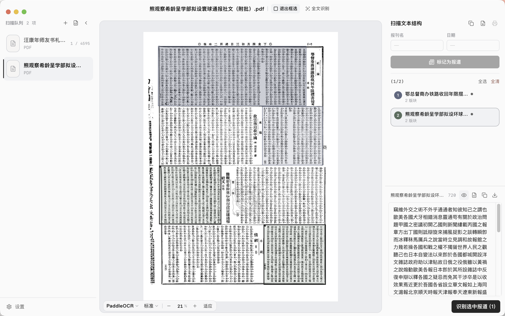
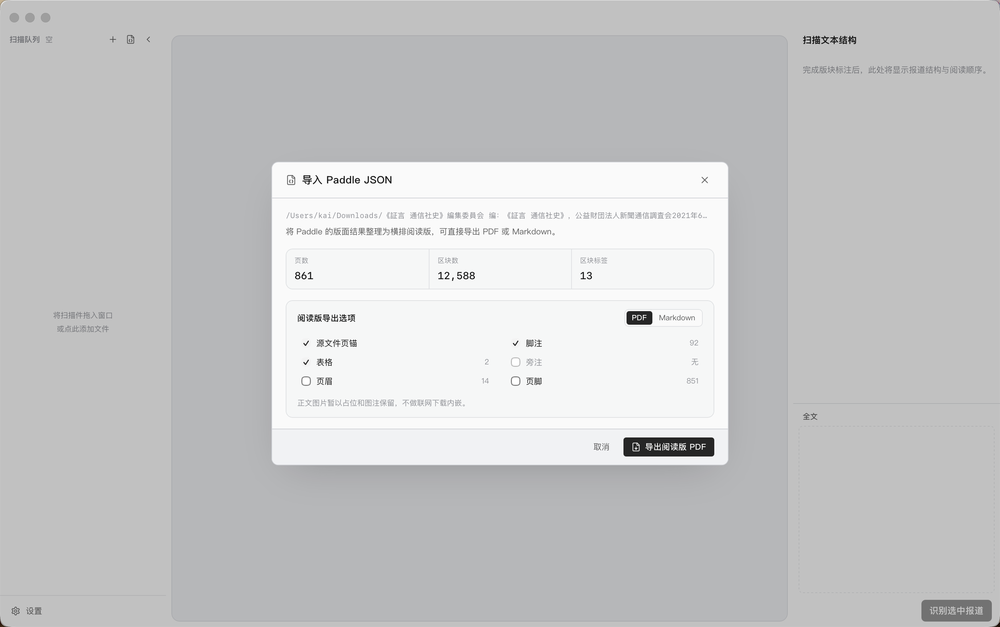

# Carpo

 [简体中文](./README_zh.md)

A desktop OCR tool built for scanned modern Chinese newspapers and scanned books. Import images or PDFs, select a news article block or run whole-page recognition, choose from multiple providers, and export the results as Markdown / plain text.

Cross-platform desktop app covering macOS (Apple Silicon) and Windows. **Windows is theoretically supported but untested, since we have no Windows device for testing.** A Docker/Web version is also available for self-hosting.

## Features

- **Two recognition modes**: selection-based article OCR (an article can span multiple blocks and multiple pages, assembled into one complete text) / full-text page-by-page recognition.
- **Multi-provider routing**: PaddleOCR (Baidu async jobs API), OpenAI Vision, OpenRouter, and any OpenAI-compatible self-hosted endpoint.
- **Structured export**: recognized articles are assembled into single Markdown documents in selection order; supports copy / export single article / export whole document.
- **Page control**: PDFs support direct page-number navigation; full-text recognition supports non-contiguous page ranges like `1-5,8,10-12`.
- **Paddle document-level OCR**: batch-call the Paddle API for an entire PDF at once; large files are automatically split and submitted in batches, with configurable language, concurrency, and pages per batch.
- **Paddle JSON reuse (desktop)**: import JSON from the Paddle web version, pre-validate block structure integrity, write per-page text, and rebuild a copyable, more readable PDF. **Note**: this feature suits horizontal or vertical books rather than newspapers.
- **Local credentials**: desktop API keys / tokens are stored via the system Keychain (macOS) / Credential Manager (Windows); the Docker version writes to `/data/secrets.json` in the mounted volume and never returns plaintext over the API.

### UI preview

**Full-text recognition**



**Selection recognition**



**Paddle JSON import**



## Installation

Download the official packages from [Releases](https://github.com/WHkDd/carpo/releases/latest):

- macOS Apple Silicon: `Carpo_*_aarch64.dmg`
- Windows: `Carpo_*_x64-setup.exe` or `Carpo_*_x64_en-US.msi` (Windows is theoretically supported, untested)

### First launch on macOS

The first double-click currently triggers a Gatekeeper block.

**Terminal command**: drag `Carpo.app` from the dmg into `/Applications`, then run

```bash
xattr -dr com.apple.quarantine /Applications/Carpo.app
```

### First launch on Windows

SmartScreen will show a blue blocking dialog. Click **More info → Run anyway**.

## Docker self-hosting

### docker compose

```bash
cp .env.example .env
docker compose up -d
```

Then open `http://localhost:8787`. On first visit, fill in your own Paddle/OpenAI/OpenRouter keys in Settings.

> **The API has no authentication.** Anyone who can reach the port can read/write settings and make paid calls using your saved keys.
> `CARPO_HOST_PORT` in `.env` defaults to `127.0.0.1:8787` (accessible on this machine only);
> only change it to `8787` (public exposure) on a trusted network. The `carpo-server` binary itself listens on
> `127.0.0.1` by default; set `CARPO_BIND=0.0.0.0` explicitly when you need external access (the Docker image already has this built in; inside the container it listens on all interfaces, while external exposure is controlled by `ports:`).

> **Base URL for self-hosted model services.** In server mode, the model Base URL in Settings must be
> `https` and must not point to loopback or internal addresses - this restriction prevents someone from using the settings API to make the server hit your internal network with your key. If your model service (Ollama, vLLM, etc.) runs on your internal network, add its hostname to
> `CARPO_BASE_URL_ALLOWLIST` to exempt it, comma-separated, supporting `host` or `host:port`:
>
> ```
> CARPO_BASE_URL_ALLOWLIST=ollama:11434,vllm.internal
> ```
>
> The desktop version is not subject to this restriction (the caller is the local machine itself).

Upgrade:

```bash
docker compose pull
docker compose up -d
```

### docker run

```bash
docker run -d \
  --name carpo \
  --restart unless-stopped \
  -p 127.0.0.1:8787:8787 \
  -v carpo-data:/data \
  ghcr.io/whkdd/carpo:latest
```

## Feature comparison: Desktop vs Docker/Web

| Feature | Desktop | Docker/Web |
|---|---:|---:|
| File import, PDF preview, page jump | ✅ | ✅ |
| Selection-based article OCR | ✅ | ✅ |
| Full-text page-by-page OCR | ✅ | ✅ |
| PaddleOCR / OpenAI / OpenRouter / OpenAI-compatible | ✅ | ✅ |
| Paddle web JSON import | ✅ | — |
| Export copyable laid-out PDF | ✅ | — |

## Roadmap

- More provider integrations (GLM-OCR, etc.)
- Local model support

## Tech stack

- **Framework**: Tauri 2.x
- **Frontend**: React 18 · Vite · TypeScript · Zustand · Konva · Tailwind · shadcn/ui
- **Backend**: Rust · `pdfium-render` · `reqwest` · `tokio` · `keyring` · Axum
- **OCR**: PaddleOCR (async jobs) · OpenAI Vision · OpenRouter · OpenAI-compatible
- **Deployment**: Tauri desktop packages · Docker multi-arch (`linux/amd64`, `linux/arm64`)

## License

MIT — see [LICENSE](./LICENSE).


